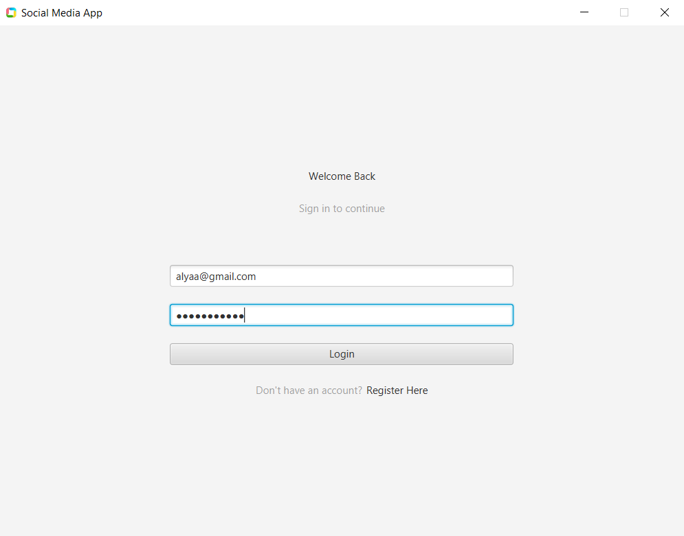
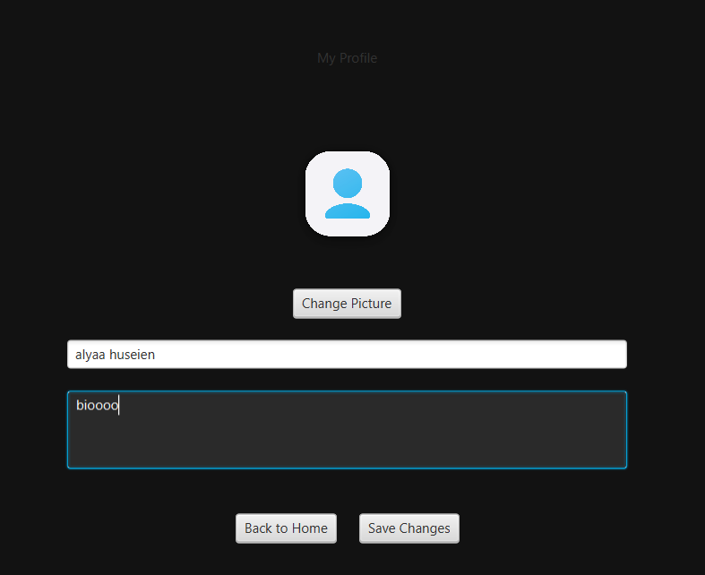
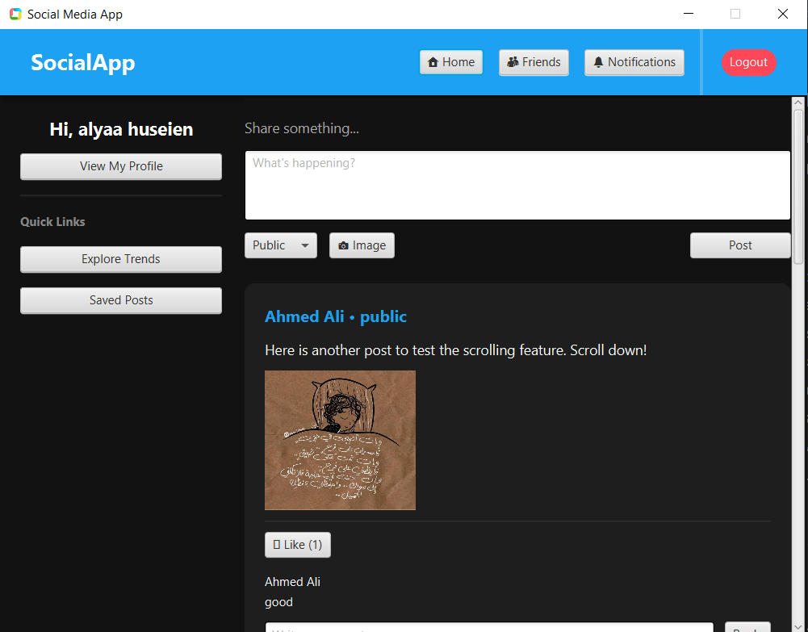
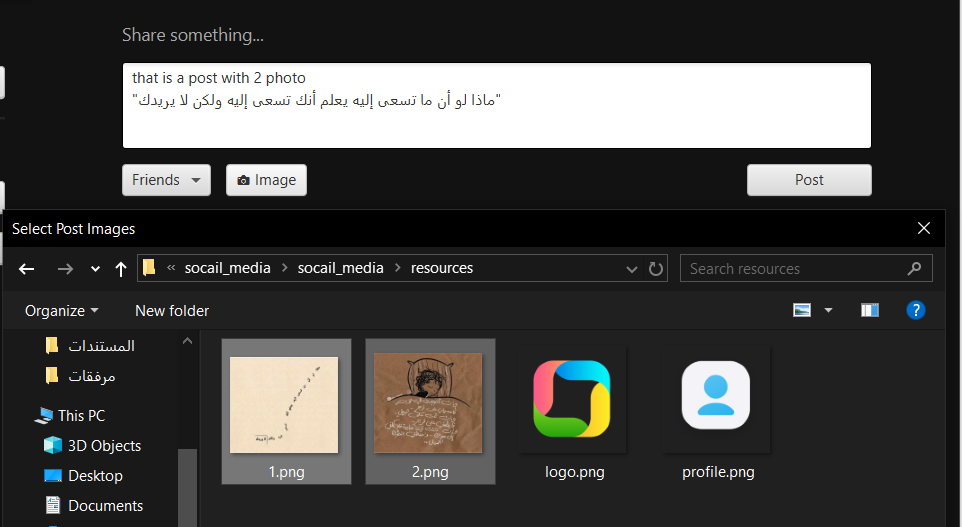

# Social Media Application

A Java-based Social Media Application built with JavaFX, MySQL, and OOP principles.  
Users can create profiles, post updates, interact with friends, and manage their account.

---

## Features

- User registration and login
- Profile creation and editing
- Posting updates and status
- Sending and accepting friend requests
- Viewing friends’ posts
- Search for users
- Simple and clean GUI

---
## Screenshots

## 📱 Project Gallery

<table style="width: 100%; text-align: center;">
  <tr>
    <td width="50%">
      
<b>🔐 Login & Authentication</b>

      
    </td>
    <td width="50%">
      
<b>👤 User Profile</b>

      
    </td>
  </tr>
  <tr>
    <td width="50%">
      
<b>🏠 News Feed & Home</b>

      
    </td>
    <td width="50%">
      
<b>📝 Create New Post</b>

      
    </td>
  </tr>
  <tr>
    <td width="50%">
      
<b>💬 Interactions (Likes & Comments)</b>

      
    </td>
    <td width="50%">
      
<b>👥 Friends & Search System</b>

      
    </td>
  </tr>
</table>[Friends](images/freinds.png)

## Technologies Used

- Java 17+
- JavaFX
- MySQL
- Eclipse IDE
- JDBC

---

## Setup

Setting up JavaFX for Eclipse can be tricky. Here are some useful links:

- Official JavaFX website: [https://openjfx.io/](https://openjfx.io/)  
- JavaFX with Eclipse guide: [https://www.eclipse.org/community/eclipse_newsletter/2019/july/article2.php](https://www.eclipse.org/community/eclipse_newsletter/2019/july/article2.php)  
- JavaFX VM arguments explanation: [https://stackoverflow.com/questions/52676825/how-to-add-javafx-module-path-and-add-modules-in-eclipse](https://stackoverflow.com/questions/52676825/how-to-add-javafx-module-path-and-add-modules-in-eclipse)  

Steps:

1. Download JavaFX SDK from the official site.  
2. Install JavaFX plugin for Eclipse.  
3. Create a new JavaFX project in Eclipse.  
4. Create a User Library in Eclipse and add JavaFX JARs.  
5. Configure the project Build Path to include the JavaFX User Library.  
6. Add VM arguments for running JavaFX:

--module-path "PATH_TO_FX_LIB" --add-modules javafx.controls,javafx.fxml

Replace `PATH_TO_FX_LIB` with the path where you downloaded the JavaFX SDK.

---

## Database Setup

1. Install MySQL: [https://dev.mysql.com/downloads/](https://dev.mysql.com/downloads/)  
2. Create a database called `social_media`.  
3. Import the SQL schema provided in `database/schema.sql`.  
4. Update the database connection in `utils/DBConnection.java` with your MySQL username and password.

---

## How to Run

1. Open the project in Eclipse.  
2. Ensure JavaFX libraries are correctly linked.  
3. Run `Main.java` as a Java Application.  
4. Alternatively, run the exported `.jar` file:

java -jar SocialMediaApp.jar

---

## Notes

- Ensure you have Java 17+ installed.  
- For JavaFX issues, double-check VM arguments and library setup.  
- The project uses local MySQL; for remote deployment, update DB connection settings.

---

## License

This project is for educational purposes only.
